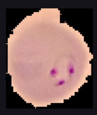
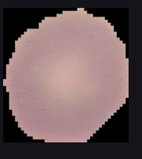

# 🦠 Malaria Cell Classification with CNN

Bu loyiha Convolutional Neural Network (CNN) yordamida hujayra tasvirlarida **malaria paraziti bor-yo‘qligini** aniqlashga qaratilgan. Loyihada sizga quyidagi imkoniyatlar taqdim etiladi:

- Tasvirlarni yuklab, avtomatik tozalash va tayyorlash
- CNN modeli yaratish va o‘qitish
- Modelni test qilish va aniqlik (accuracy) baholash
- Natijalarni vizual ko‘rish
- Parazitlangan va sog‘lom hujayralar o‘rtasidagi farqlarni ajratish

---

## 📂 Loyiha Tuzilmasi

```bash
malaria-cnn-classifier/
├── cell_images/              # Dataset (Parasitized va Uninfected)
├── malaria_cnn.ipynb         # Asosiy kod va model
├── models/
│   └── malaria_model.h5      # Trained model (CNN)
├── utils/
│   └── load_data.py          # Datasetni yuklovchi va tayyorlovchi skript
├── images/
│   ├── example_parasitized.png
│   ├── example_uninfected.png
│   └── result_accuracy.png   # Model accuracy grafik natijasi
└── README.md                 # Loyiha hujjati


### 🦠 Parazitlangan hujayra (yomon)


---

### ✅ Sog‘lom hujayra (yaxshi)


---

## 📊 Modelning natijaviy grafigi

Quyidagi rasmda CNN modelining o‘qitishdagi `accuracy` va `loss` grafigi ko‘rsatilgan:


Classification Report:
              precision    recall  f1-score   support

           0       0.94      0.95      0.95      2756
           1       0.95      0.94      0.95      2756

    accuracy                           0.95      5512
   macro avg       0.95      0.95      0.95      5512
weighted avg       0.95      0.95      0.95      5512

Confusion Matrix:
[[2627  129]
 [ 168 2588]]